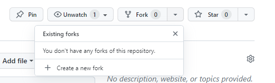

# How to contribute

- Make a GitHub Account

- Go to the [repository](https://github.com/bjsilver/bag_wiki)
- Press 'Fork', then create new fork. This enables you to make changes to a personal version of the repository.
- Once created, navigate to the directory, e.g. Docs -> FAQs. Press 'Add file', then 'Create new file'.
- Fill in your file name, appending the name with .md (markdown)
- Enter your text / images / tables.
- Press 'Commit Changes'.
- Add a description of the change you have made and press 'Commit Changes'.
- So far you've generated a file and committed it to your fork (your version of the website).
- Now, to send it to admin for approval, submit this commit as a pull request.
- On the following page, Press 'Create a Pull Request'. This has now sent your change request to an admin for approval.
- Your request will be approved / edited and subsequently appear on the [website](https://bjsilver.github.io/bag_wiki/)

- Many thanks
