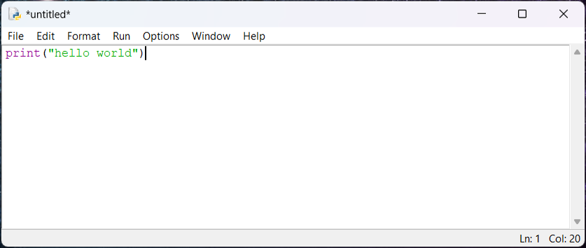
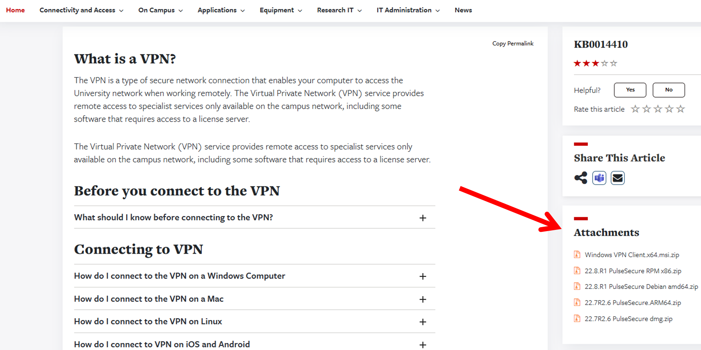
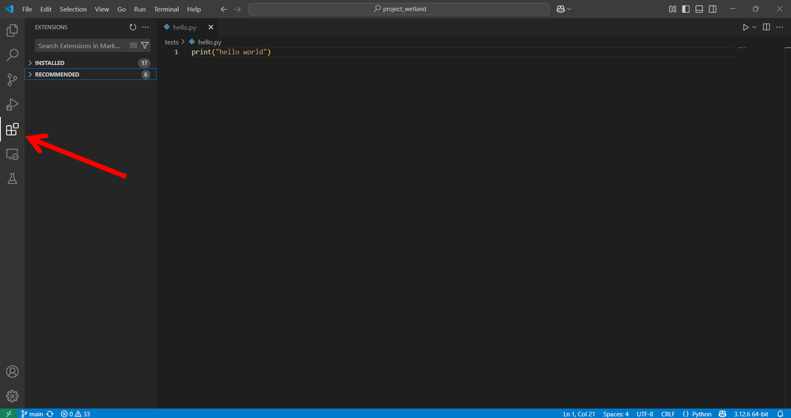
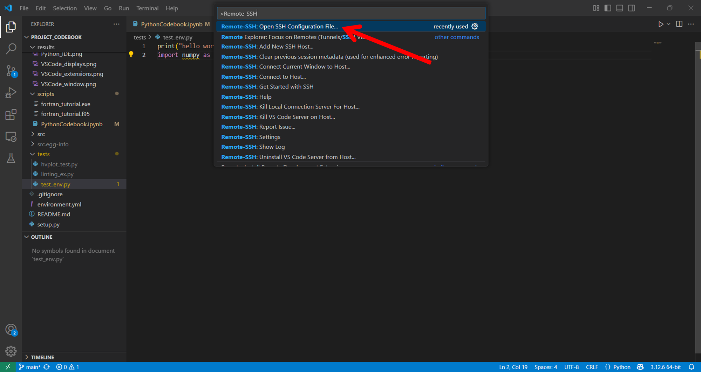
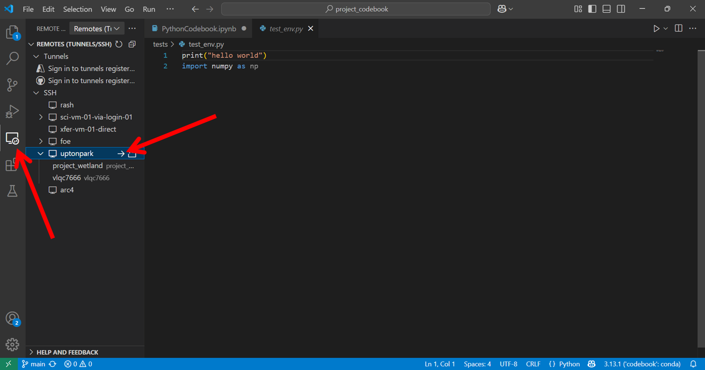
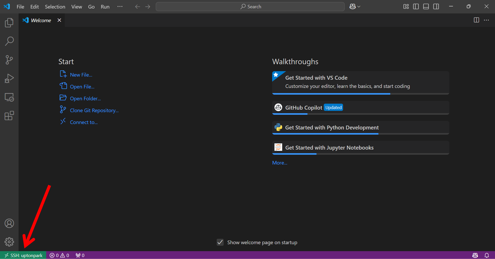
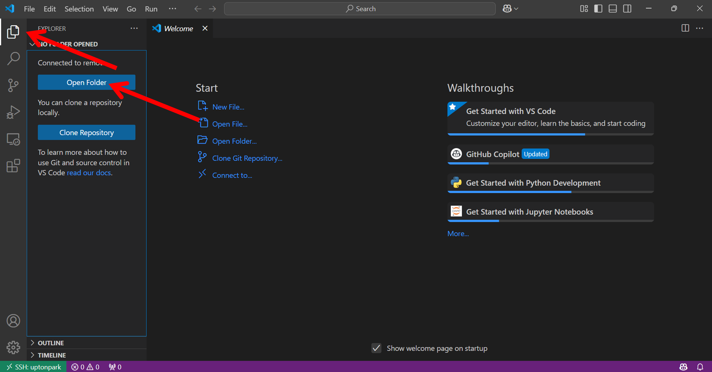
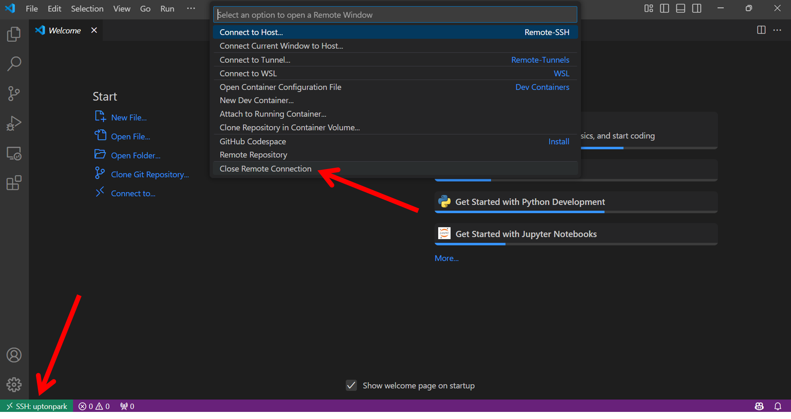
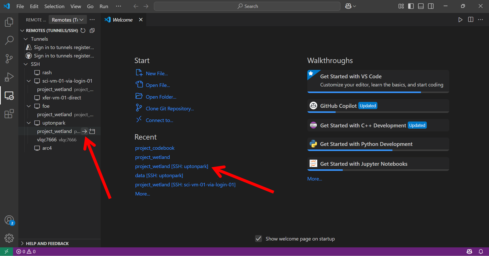

# Guide to VS Code
by Ben Bradley, 29/03/2025
(last updated 04/11/2025)

## 🏁 Introduction

_This document is intended as a guide to modern programming for researchers and students within the School of Earth and Environment, primarily using Python and VS Code._

Throughout, I draw upon the expertise shared in the following sources:
- [The BAG Wiki](https://bjsilver.github.io/bag_wiki/), particularly the [Guide to VS Code](https://bjsilver.github.io/bag_wiki/docs/remote_access/vscode.html)
- [The Good Research Code Handbook](https://goodresearch.dev/index.html)

### Contents
- ❓ What is VS Code and Python?
- 🏗️ How do I set this up?

## ❓ VS Code and Python

### Python

<figure>
    
    <figcaption>The benefits of Python. From <a href="https://xkcd.com/353" target="_blank">xkcd.com</a> by Randall Munroe </figcaption>
</figure>

Python is one of the most successful programming languages, and for a reason! It values *readability* above all else, making it very user-friendly.
It is open-source and primarily relies on importing libraries others have created to solve problems efficiently. This means you can lean on the
work of others, who have likely solved the problem far more efficiently and cleanly than you could!

Many people start using Python via the Python-provided Integrated Development Environment (IDE) or directly through the terminal. These are excellent
places to get to grips with Python when first learning the language, as they allow you to focus on the basic coding you'll encounter in tutorials.
Complications arise when you want to do more than the basics, though.

<figure>
    
    <figcaption>Bog standard Python IDE, perfect as a learning sandbox but not much else</figcaption>
</figure>

### Environment Managers

Python relies on libraries for most interesting things anyone might actually want to do. Perhaps you've found yourself in the following situation before?

- discover a cool thing you want to try out in Python
- find you need a specific library
- `import library` doesn't work!
- google the error message
- find that you need to install the library using a command called `pip`
- your computer doesn't recognise the command `pip`
- other people say to use `conda install` but this doesn't work either
- some random guy from StackOverflow says everything will work if you use `pip3`
- give up

You need a **package manager**! Setting this up means you can easily and dependably install any libraries you may need.

Once you start installing lots of libraries, you'll eventually find that some conflict with others. If you get unlucky,
you'll install a library and find that your code no longer runs! To avoid this, you need a **virtual environment manager**:
something that resolves package dependencies and installs libraries in virtual environments that can easily be deleted and
refreshed if something goes wrong.

Some popular examples of joint package and virtual environment managers are _Anaconda_, _Miniconda_, and _Miniforge_, which
we'll look at later. Without one of these, your Python environment can become a messy hellscape :(

### VS Code
But if you're doing lots of coding, you don't just want your code to *run*. Is it clear, efficient, well-documented, backed-up,
shareable? This is where more complete IDEs like VS Code come in!

Visual Studio Code (VS Code) offers many attractive features, such as:
- Multi-language support
- Variable auto-completion syntax highlighting
- Robust terminal interfaces **AND** intuitive feature-rich graphical interfaces
- Seamless version control with Git and GitHub
- Jupyter Notebooks!
- Easy ways to explore netcdfs, tables, plots, and files
- Installable extensions like auto-generated documentation, AI coding suggestions, and more!

Hopefully this convinces you that VS Code is worth the effort to set up and use for day-to-day coding tasks. We'll explore
_how_ to set this up in the following section.

(For more information, visit the [BAG wiki guide to VS Code](https://bjsilver.github.io/bag_wiki/docs/remote_access/vscode.html))


## ⚠️ IMPORTANT: A Note on VS Code Compatibility

At the moment, the university is transitioning its "general compute" resource for the faculty of environment from the old foe-linux
machines that run on CentOS to modern machines run with RedHat9. The old machines have outdated software, requiring a downgrade to
version 1.98 of VS Code to enable use. The new machines are, as of 06/10/2025, not fully configured and still have some problems.

New and existing users therefore have a choice of two paths, both of which are described in this guide:
1) Downgrade VS Code and make use of the more reliable old machines, with some potential hiccups from VS Code and its extensions to navigate
2) Install the latest version of VS Code and be prepared to report some problems as the system is set up (contact Steve Arnold for this).

It is currently recommended to choose option 1, but all researchers will eventually need to migrate to the new system.

## 🏗️ Setting Up
### 1) University VPN
<ol type="a">
  <li>At the time of writing there are two types of university VPN: PulseSecure and Ivanti Secure Access. One of these is needed to connect to university systems remotely.</li>

  <ol type="i">
    <li>Already installed</li>
      <p>If you have a university computer, the VPN may be pre-installed. For Windows, check by going to the start menu and typing “Pulse Secure” or "Ivanti Secure Access".</p>
    <li>Uni laptop but not pre-installed</li>
      <p>If PulseSecure isn’t already available, it can be installed via Company Portal. Search the start menu for “Company Portal”. PulseSecure should be listed under the 'Apps' section.</p>
    <li>Personal computer</li>
      <p>Go to the <a href="https://it.leeds.ac.uk/it?id=kb_article_view&table=kb_knowledge&sys_kb_id=1682f199fbd426d08d23ff40aeefdc14&searchTerm=vpn&spa=1" target="_blank">University of Leeds VPN guide</a>. Under attachments to the right of the screen, there is a list of VPN versions you can download. Select the appropriate download for your operating system and follow the setup wizard instructions.</p>
  </ol>

  <li>Once you have the VPN installed, follow the instructions on the <a href="https://it.leeds.ac.uk/it?id=kb_article_view&table=kb_knowledge&sys_kb_id=1682f199fbd426d08d23ff40aeefdc14&searchTerm=vpn&spa=1" target="_blank">VPN guide</a>, which detail how to connect.</li>
</ol>

*(n.b. an alternative method to this is to use the rash jump server: I have found this way requires more passwords and a Duo sign-in, but university IT plans to switch to this method at some point. A guide for using rash can be found here: [BAG guide to rash](https://bjsilver.github.io/bag_wiki/docs/remote_access/SSH_configs.html))*

### 2) Installing VS Code

<ol type="a">
  <li>Install VS Code</li>
    <p>It is recommended to download <a href="https://code.visualstudio.com/updates/v1_98" target="_blank">VSCode version 1.98</a> on a local PC if you plan to use the old foe-linux machines. (If using the new foe-linux-cpu machines, simply download the latest version <a href="https://code.visualstudio.com/" target="_blank">here</a> and ignore the rest of this step). When you download an outdated version of VSC (e.g. February 2025, version 1.98) make sure you are downloading the version from the third line in the page, not from the more interesting blue button (this is the latest version, the name is in the downloaded file anyway). Additionally, to avoid VS Code auto-updating the next day, follow the next steps:
    <ol type="i">
      <li>Open Settings by pressing <code>Ctrl</code>+<code>,</code></li>
      <li>Type "update mode" in the search bar</li>
      <li>Find the setting labelled "Update: Mode" and change to "None" to disable auto-updates</li>
      <li>Click the "Restart" button to apply the changes.</li>
    </ol>
    </p>
  <li>Extensions</li>
    <p>Open VS Code and click the extensions tab on the left side of the screen. Search for and install the <em>Python</em>, <em>Jupyter</em>, and <em>Remote - SSH</em> extensions. These are needed to use Jupyter notebooks and access remote machines. If you downloaded a downgraded version of VS Code in the previous step, you'll also need to downgrade these extensions:
    <ol type="i">
      <li>Jupyter (install specific version: 2024.11.0 & turn off auto-update)</li>
      <li>Python (install specific version: 2025.12.0 & turn off auto-update)</li>
      <li>Pylance (install specific version: 2025.4.1 & turn off auto-update)</li>
      <li>Remote SSH (no downgrade necessary, as far as we know!)</li>
    </ol>
    </p>
</ol>

### 3) config file

To ssh easily into remote machines like foe-linux, it's easiest to create a config file containing the details of the ssh connections you want to make. This is a file called `config` stored in the `.ssh` folder of your local machine. For linux users, the full path location will simply be `~/.ssh/config`. For Windows users, this might be in a different location but you'll likely have a `.ssh` folder somewhere. For instance, the path to mine is `C:\Users\{my username}\.ssh\config`. Whether you can find it in your file explorer or not, you'll be able to edit your config file in VS Code. Detailed instructions are on the [BAG Wiki](https://bjsilver.github.io/bag_wiki/docs/remote_access/vscode.html) if you get stuck, but in short:

<ol type="a">
  <li>open the command pallete using <code>Ctrl</code>+<code>Shift</code>+<code>P</code>.</li>
  <li>search for "Remote - SSH". An option to open a config file should appear.</li>
  
  <li>Specify connections to at least a foe-linux server and additionally to a machine on foe-linux (silloth, lytham, uptonpark, etc.) by copying the text below. </li>
  <li>Save the config file, close VS Code and reopen.</li>
</ol>


```
Host foe
    HostName foe-linux-01.leeds.ac.uk    # change to a different foe-linux server if you want (e.g. foe-linux-02)
    ForwardX11Trusted yes
    ForwardAgent yes
    User (username)                      # change to your username
    TCPKeepAlive no
    RequestTTY force

Host (machine_name)                      # change to the machine you want to connect to
    HostName (machine_name).leeds.ac.uk  # change to the machine you want to connect to
    ForwardX11Trusted yes
    User (username)                      # change to your username
    ForwardAgent yes
    TCPKeepAlive no
    ProxyJump foe
    RequestTTY force

###################################################
# some other useful hosts
###################################################

Host rash                                # this is a jump server used as an alternative to a VPN connection, requires Duo authentication
  User (username)
  HostName rash.leeds.ac.uk
  ServerAliveInterval 60
  ServerAliveCountMax 90
  ForwardX11 yes
  ForwardX11Trusted yes
  ForwardAgent yes
  ControlPath ~/.ssh/sockets/%r@%h:%p
  ControlMaster auto
  ControlPersist 12h

Host JASMIN-sci                          # requires setting up ssh keys
  Hostname sci-vm-04.jasmin.ac.uk
  User (username)
  ProxyJump (username)@login-01.jasmin.ac.uk
  ForwardAgent yes

Host JASMIN-ph                           # requires setting up ssh keys
  Hostname sci-ph-02.jasmin.ac.uk
  User (username)
  ProxyJump (username)@login-01.jasmin.ac.uk
  ForwardAgent yes

Host foe-cpu
  User (username)
  HostName foe-linux-cpu.leeds.ac.uk
  ServerAliveInterval 60
  ServerAliveCountMax 90
  ForwardX11 yes
  ForwardX11Trusted yes
  ForwardAgent yes
  ProxyJump rash.leeds.ac.uk
```

Notes:
- **Remember** to change the username with your own and the remote machine with one you want to access!
- See the BAG Guides to [SSH config files](https://bjsilver.github.io/bag_wiki/docs/remote_access/SSH_configs.html), [SSH Keys](https://bjsilver.github.io/bag_wiki/docs/remote_access/SSH_key_pairs.html), and [VS Code](https://bjsilver.github.io/bag_wiki/docs/remote_access/vscode.html) for more details.
- If you find VS Code is timing out before connecting, you can change the "Connect Timeout" value in "Remote - SSH: Settings". [The BAG guide to VS Code](https://bjsilver.github.io/bag_wiki/docs/remote_access/vscode.html) tips section says setting this parameter to around 1080 should solve this (it did for me).
- If you decide to use rash instead of the University VPN, you will need to add it as a host to your config file and ProxyJump through rash to connect to foe (see [BAG wiki article](https://bjsilver.github.io/bag_wiki/docs/remote_access/SSH_configs.html)).
- You could try to combine [ssh keys](https://bjsilver.github.io/bag_wiki/docs/remote_access/SSH_key_pairs.html) with this sign in method to reduce the number of passwords required, but as of writing I have not attempted this.


### 4) ssh into remote machine

<ol type="a">
  <li>ssh-ing</li>
  <p>Go to the Remote Explorer side pannel on the left. The host names you added to your config file should be listed under SSH. Connect to one of them. Depending on the connection, you may be prompted to enter your password multiple times. You may also be required to select the operating system of the machine you are connecting to (linux) and dismiss some popups.</p>
  <li>Connected!</li>
  <p>You should land in the remote machine with a page that looks something like the one below. Note the box in the bottom left which should display the name of the host you are connected to.</p>
  <li>Install Extensions</li>
  <p>Install the same extensions you installed in step 2b on the remote machine, again by navigating to the extensions side tab.</p>
  <li>Open project directory</li>
  <p>From here you can open the directory for your coding project, allowing you to view and navigate all files in your project! Open the Explorer side pannel on the left and click Open Folder. You can then navigate to a project directory of your choice. You will need to inseret your password again as the connection reestablishes from the new directory. If you don't already have a folder, you can create one in the terminal (accessed via VS Code through View > Terminal or Terminal > New Terminal).</p>
  <li>Closing the connection</li>
  <p>Once you're finished, remember to save all documents and close the remote connection. To do this, click the SHH block in the bottom left, then choose "Close Remote Connection".</p>
  <li>Shortcut for next time</li>
  <p>The next time you connect, you can connect directly to the folder you opened on the remote machine, without having to open the project folder and re-input your passwords! In the image below, VS Code has remembered me connecting to my <code>project_wetland</code> folder via uptonpark, and I can click either one to connect directly to that folder.</p>
</ol>


### 5) Set up an environment manager

Now you need to install an environment manager on the machine you want to code on. You use this to create virtual environments and install libraries. If you encounter dependency problems within your environment, you can easily create a new one and install a new set of libraries there. You need to set this up wherever you do your coding, so ideally on a disk in foe-linux (**NOT** your home directory as you won't have enough space). It's good practice to create a new environment for each project.

There are a couple of options to choose from. I have found that Miniforge works best for Linux machines, as it installs packages via conda-forge by default, making it faster and more reliable than other methods. However, I have had problems installing it locally on my university Windows laptop as it gets flagged as malware by the IT security. Miniconda is a good alternative for local work on university Windows computers.

(⚠️Note that taught students will need to change their .bashrc file to allow installation of Miniforge, see details below)

The following instructions are for installing Miniforge on a disk connected to foe-linux.

<ol type="a">

  <li>Disk access</li>
  <p>You will need to be allocated a username directory on one of the disks connected to foe-linux. Once you have this set up, use VS Code to SSH into foe-linux or a machine connected to foe, as described in the previous section. Open a terminal (Terminal > New Terminal) and navigate to your username directory on one of the disks where you want Miniforge installed (e.g. <code>cd /nfs/b0249/Users/$USER/</code>).</p>

  <li>Installing Miniforge</li>
  <p>The full instructions are available in the README document on the <a href="https://github.com/conda-forge/miniforge" target="_blank">Miniforge repository</a> (or the <a href="https://www.anaconda.com/docs/getting-started/miniconda/install#quickstart-install-instructions" target="_blank">Miniconda webpage</a> if you prefer to install this). For Miniforge, these are under the "Unix-like platforms (macOS, Linux, & WSL)" header under "Install". I'll summarise the commands here, but make sure you run these on a disk, not your home directory!

  Download the installer using <code>wget "https://github.com/conda-forge/miniforge/releases/latest/download/Miniforge3-$(uname)-$(uname -m).sh"</code>

  Now run the intaller using <code>bash Miniforge3-$(uname)-$(uname -m).sh</code>

  When asked where to install Python, don't accept the default suggestion, type in the filepath of the disk (i.e. /nfs/b0249/Users/$USER/minforge3) to install it there.
  </p>

  <li>Create a test environment</li>
  <p>Once you've completed the install instructions, be sure to activate the base environment by typing <code>conda activate</code> in the terminal.
  
  The terminal should now show (base) at the start of the command line. If you type <code>conda list</code>, a list of the basic packages installed in this environment will be listed.
  
  Now type <code> conda create -n test_env</code> to create a new environment called "test_env".
  
  You need to activate this new environment by typing <code>conda activate test_env</code>. You can deactivate an environment by typing <code>conda deactivate</code>.</p>

  <li>Useful Python libraries</li>
  Create a new environment (rename it something memorable) and install some useful Python libraries:
  <ul>
    <li>matplotlib and cartopy for basic plotting</li>
    <li>xarray, netcdf4, and dask for handling gridded datasets</li>
    <li>rioxarray and geopandas for shapefiles</li>
    <li>xesmf for regridding</li>
    <li>notebook for all Jupyter notebook-related libraries</li>
  </ul>
  <code>conda create -n myenv</code>
  
  <code>conda activate myenv</code>
  
  <code>conda install matplotlib cartopy xarray netcdf4 dask rioxarray geopandas xesmf notebook</code>

  <li>Jupyter Notebook</li>
  <p>Create a new Jupyter notebook <code>test_notebook.ipynb</code> by clicking "New File" under the Explorer side panel and naming it.
  
  Create a code cell and add some simple code.
  
  In the top right of the screen, click the "Select Kernel" button. Under "Python Environments" you should find the environment you created earlier with notebook installed. Once this is selected, run the code cell: it should run.</p>
</ol>

#### ⚠️For taught students (e.g. Master's or Undergraduate students):

Before attempting the steps above for setting up the environment manager Miniforge, you will need to modify the .bashrc file in the home directory of your foe-linux account to be able to do this. Open this file by typing `nano ~/.bashrc` in a terminal connected to foe-linux. Student .bashrc files may have a line `source /nfs/see-fs-01_teaching/.bashrc` which should be commented out by prepending a `#`. Now save and close the file, logout and back in again and follow the steps starting from 5a.
