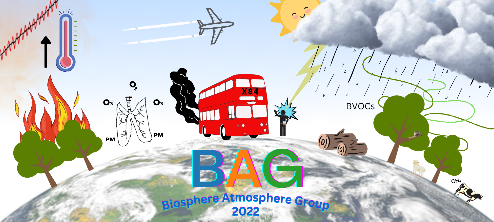

# Welcome to the BAG Wiki!

### What is this for?
A wiki for BAG to share IT/python FAQs and tips. Useful content you could add...
- Computer resources are available and how to access them
- Useful python scripts that are generally useful (e.g. regridding, making maps)
- Add questions and answers from the 'IT and coding help' Teams channel

### How to contribute
To contribute, either email your contribution to Ben or Callum, comment your content in the 'Coding or IT help' Teams Channel, or submit the change as a Pull Request. A detailed guide on how to submit a change as pull request can be found [here](https://bjsilver.github.io/bag_wiki/docs/how_to_contribute.html). Don't worry about getting the formatting right!
### ***[Ask a question/start a discussion](https://github.com/bjsilver/bag_wiki/issues)***

### How this site works
Made using the bare minimum Just the Docs theme template available [here](https://github.com/just-the-docs/just-the-docs-template/tree/main).
Visit [https://just-the-docs.com/](https://just-the-docs.com/) for a guide on how to build the wiki.
